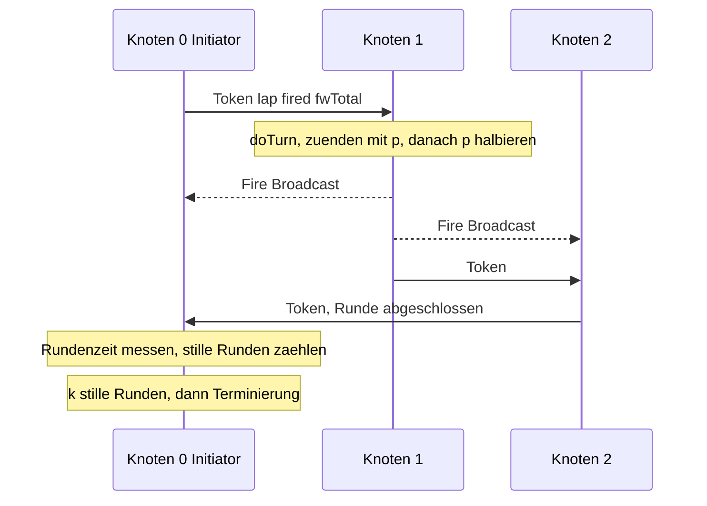
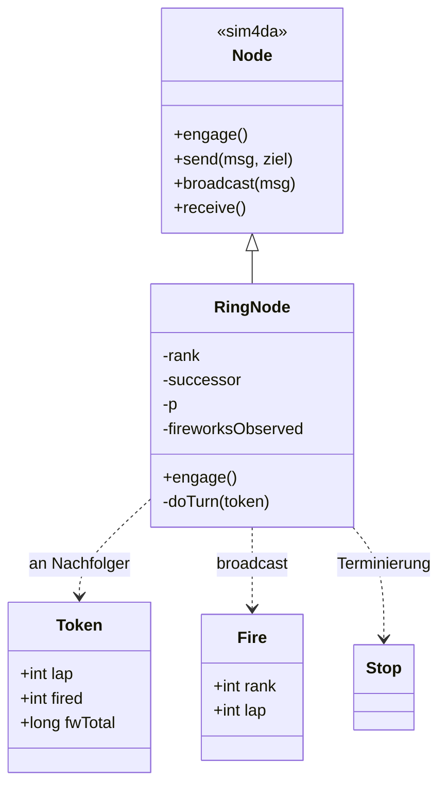
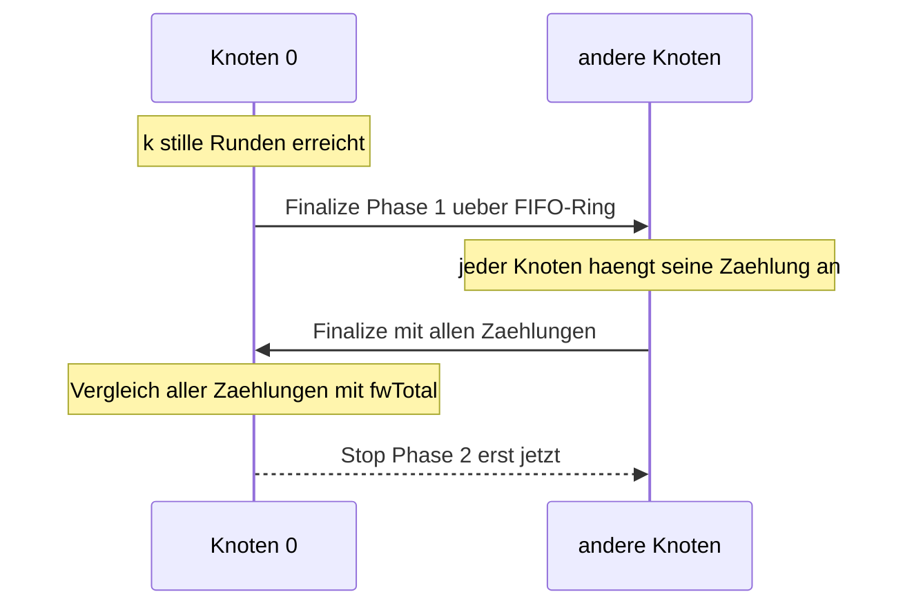

# Ergebnisbericht – Ein Feuerwerk an Nachrichten

**Modul:** Verteilte Systeme, Übungsblatt 1 (Aufgaben 1–4), Sommer 2026
**Begleitliteratur:** Coulouris, Dollimore, Kindberg – *Distributed Systems*, 5. Aufl. 2013 (`Coulouris`);
Van Steen, Tanenbaum – *Distributed Systems*, 3. Aufl. 2017 (`Van Steen`).

---

## 1. Die Anwendung

`n` Knoten bilden einen **logischen Ring** (Overlay). Ein **Token** („Streichholz") kreist von
Knoten `i` zu `(i+1) mod n`. Wer das Token hält, **zündet mit Wahrscheinlichkeit `p` eine Rakete**
(Broadcast an alle Knoten), **halbiert** danach sein `p` und reicht das Token weiter. Die Anwendung
**terminiert, wenn in `k` aufeinanderfolgenden Runden niemand gezündet** hat. Knoten 0 ist Initiator:
er injiziert das Token, misst Rundenzeiten, zählt Runden/Raketen und entscheidet über die Terminierung.

Erhoben werden je Konfiguration: **Token-Runden**, **gesendete Multicasts** (Raketen), **min/mittlere/
maximale Rundenzeit** sowie das **maximal erreichbare `n`**. Die Token-Weitergabe realisiert
zugleich **gegenseitigen Ausschluss** auf dem Ring (*Coulouris §15.2*); die Raketen sind
**Gruppen-/Multicast-Kommunikation** (*Coulouris §4.4.1, §15.4 / Van Steen §4.4*).

Drei Realisierungen derselben Anwendung wurden gebaut und verglichen: **(1)** pseudo-verteilt mit
echten UDP-Sockets auf localhost, **(2)** verteilt über reale Rechner, **(3)** als In-Process-
**Simulation** (sim4da). **Aufgabe 4** ergänzt die Simulation um Konsistenz-Mechanismen.

### Token-Runde und Terminierung (UML-Sequenz, vereinfachter Ring n=3)

---

## 2. Aufgabe 1 – Pseudo-verteilt (UDP, localhost)

**Realisierung:** `n` echte OS-Prozesse (JVMs) auf `127.0.0.1`, reines `java.net`. Pro Knoten zwei
Threads: ein **Token-Thread** (Unicast-`DatagramSocket` an `basePort+rank`) und ein
**Multicast-Listener** (`MulticastSocket` in Gruppe `mcAddr:mcPort`) für `FIRE`/Steuer-Nachrichten.
Eine **READY/GO-Startbarriere** synchronisiert den asynchronen Prozessstart; bei Leerlauf beendet
sich jeder Knoten selbst (kein Zombie), ein Python-Watchdog räumt auf. Das Token wird bei Verlust
**nicht** neu gesendet — die UDP-Semantik (*Coulouris §4.2.1*) bleibt sichtbar (wichtig für Aufgabe 4).

**Geteilter Zustand / Nebenläufigkeit:** `volatile boolean running`, `AtomicInteger
fireworksObserved`, `synchronized Set<Integer> readyRanks`, `CountDownLatch goLatch` — der
Multicast-Listener und der Token-Thread teilen sich Zustand, daher explizite Synchronisierung.

**Messung (`run_experiments.py`, `-Xmx32m -Xss512k`):**

| n | Runden | Multicasts | rt_min (ms) | rt_mean (ms) | rt_max (ms) |
|----:|----:|----:|----:|----:|----:|
| 4 | 7 | 7 | 0.44 | 10.9 | 42.8 |
| 32 | 12 | 27 | 5.0 | 46.1 | 428 |
| 128 | 9 | 128 | 25.9 | 398 | 2502 |
| 256 | 13 | 283 | 54.4 | **782** | 6626 |

**Maximales n = 256** (begrenzt durch Prozess-/Socket-/Port-Ressourcen). Die Rundenzeit wächst ~linear
mit `n` (eine Runde = `n` Netz-Hops über den Loopback-Stack) und streut stark (Scheduling-/UDP-Jitter).

---

## 3. Aufgabe 2 – Verteilt (reale Rechner)

**Realisierung:** dieselbe Knotenlogik, generalisiert auf eine **Membership-Tabelle** (`rank →
host:port`) statt fest verdrahtetem localhost; gesteuert über Umgebungsvariablen (`RING_MEMBERS`,
`RING_BCAST`, `RING_BIND`). Broadcasts werden „nach Möglichkeit" auf **UDP-Multicast** abgebildet,
sonst auf **`n−1` Unicasts** — Letzteres ist auf Android (Termux/OpenJDK 17) nötig, weil die WLAN-
Schicht eingehende Multicasts ohne `MulticastLock` verwirft. Aufbau: **PC = Knoten 0**, **Android-
Handy = Knoten 1**, realistisch `n = 2`.

**Praxisbefund (ehrlich dokumentiert):** Mehrere reale Durchläufe scheiterten an der **Netz-
Umgebung**, nicht am Code.
*(a)* Im **CIP-Pool** der Uni wurde Aufgabe 2 **gemeinsam mit Kommilitonen** auf mehreren
Pool-Rechnern ausprobiert — ein Durchlauf gelang **nicht**: die Pool-Rechner ließen die gegenseitige
UDP-Kommunikation nicht zu (vermutlich Client-Isolation bzw. Firewall-Restriktionen des Lab-Netzes).
*(b)* Auch im privaten WLAN war der Echtlauf durch **Client-Isolation** blockiert — der PC hatte eine
**öffentliche** Adresse (Campus-/Provider-Netz), PC ↔ Handy konnten sich nicht erreichen
(100 % packet loss). Dokumentierter Ausweg: **Handy-Hotspot/USB-Tethering** (eigenes, privates Subnetz
ohne Isolation) plus Windows-Firewall-Freigabe für eingehendes UDP. Das ist selbst ein lehrreiches
Ergebnis über reale Netze (*Coulouris §3 NAT/Adressierung, §2.4 Latenz/Fehlermodell*): die
Implementierung ist korrekt, aber die **Umgebung** (Isolation, Firewall) dominiert den Aufwand.

**Erwartung/Messung:** Rundenzeiten im **ms-Bereich (echte WLAN-RTT)** statt µs/ms wie auf localhost;
**max n = Anzahl erreichbarer Geräte** (hier ≈ 2). Jeder Knoten ist ein echter, unabhängiger Rechner
(keine geteilten JVM-/CPU-Ressourcen) — der eigentliche Gewinn der Verteilung.

---

## 4. Aufgabe 3 – Simuliert (sim4da)

**Realisierung:** Nachbildung im In-Process-Simulator **sim4da** (Ausgangspunkt: dessen Test
`OneRingToRuleThemAll`). Jeder Knoten ist ein **Thread** in **einer** JVM; Kommunikation läuft über
**Mailboxen** (`send(msg, name)`) und einen **nativen `broadcast()`**. Nachrichten sind unveränderliche
**`record`s** (`Token`, `Fire`, `Stop`). Rundenzeiten werden weiterhin **real** (`System.nanoTime()`)
gemessen; im Ring wird **nicht** `sleep()` benutzt (das wäre Simulationszeit).

**Vereinfachungen gegenüber UDP** (Kernaussage): die Kanäle sind **zuverlässig und FIFO**, daher
entfallen READY/GO-Startbarriere, Token-Retransmit, `stalled`-Behandlung, Multicast-Interface-Wahl
und der zweite Thread pro Knoten samt `volatile`/`Atomic`. Der gesamte Ring ist **eine** Java-Datei.

### Struktur (UML-Klassendiagramm)

**Messung (`run_sim.py`, `-Xss256k -Xmx2g`):**

| n | Runden | Multicasts | rt_min (ms) | rt_mean (ms) | rt_max (ms) |
|----:|----:|----:|----:|----:|----:|
| 256 | 11 | 242 | 1.05 | **19.4** | 160 |
| 1024 | 13 | 1084 | 2.58 | 81.6 | 688 |
| 4096 | 19 | 4148 | 8.65 | 805 | 8298 |
| **8192** | 16 | 8108 | 19.5 | 3372 | 27153 |

**Maximales n = 8192.** Die Grenze ist hier die mit `n` linear wachsende **Rundenzeit** (n Hops +
Kontextwechsel tausender Threads), **kein** hartes Thread-Limit — bei n = 16384 dauerte eine Runde
länger als der 90-s-Watchdog. Mit kleinerem `-Xss` ginge `n` höher, aber unpraktikabel langsam.

---

## 5. Aufgabe 4 – Konsistenz

### Konsistenzkriterien

- **K1 – Token-Konsistenz (gegenseitiger Ausschluss):** genau ein Token; `lap`-Nummern bei jedem
  Knoten monoton steigend. *(Coulouris §15.2)*
- **K2 – Agreement über die Feuerwerke:** am Ende kennt jeder Knoten dieselbe Raketenzahl = `fwTotal`.
  *(Multicast-Agreement Coulouris §15.4; Konsistenz Van Steen Kap. 7)*
- **K3 – Kausale Terminierung:** das `Stop`-Signal überholt kein Feuerwerk. *(geordnetes Multicast,
  Coulouris §15.4)*

### Mechanismen

1. **Lamport-Uhren** (*Coulouris §14.4 / Van Steen §6.2*): jede Nachricht trägt `ts`; `++lamport` bei
   Ereignis/Send, `max(·,ts)+1` bei Empfang — der kausale Rahmen, in dem „inkonsistent" definierbar ist.
2. **Erkennen & Melden:** K1 wird lokal an jedem Knoten geprüft. K2 global über eine **zweiphasige
   Terminierung**: nach `k` stillen Runden zirkuliert Knoten 0 ein **`Finalize`-Token** durch den
   Ring, jeder Knoten hängt seine beobachtete Zählung an; zurück bei Knoten 0 erfolgt der Vergleich
   gegen `fwTotal` → `CONSISTENCY verdict=ok|INCONSISTENT …`.
3. **Vermeiden:** Die Sammlung über den **FIFO-Ring** (statt eines *racing* `Stop`-Broadcasts)
   garantiert **K3** — dank FIFO hat jeder Knoten beim `Finalize` alle vorher zugestellten Feuerwerke
   schon verarbeitet. Damit ist die Sicht **konsistent by construction**.

### Ergebnisse

**Zuverlässige Kanäle (`loss=0`):** durchgängig **konsistent** — jeder Knoten beobachtet exakt
`fwTotal` (geprüft für n = 2, 4, …, **1024**: `observed_min == observed_max == fwTotal`,
`disagreeing = 0`, `lap_violations = 0`).

**Fehlerinjektion (`--inject-loss 0.2`, simuliert UDP-Omission):** durchgängig **erkannt**.

| n | fwTotal | observed (min..max) | disagreeing | verdict |
|----:|----:|:--:|:--:|:--:|
| 8 | 9 | 7..8 | 8/8 | INCONSISTENT |
| 64 | 58 | 40..53 | 64/64 | INCONSISTENT |
| 256 | 256 | 187..221 | 256/256 | INCONSISTENT |

Schon bei 20 % Verlust hat **kein** Knoten mehr die korrekte Sicht — und der Detektor meldet es mit
konkreten Knoten-Deltas.

---

## 6. Vergleich & Diskussion

| | Aufgabe 1 (UDP localhost) | Aufgabe 2 (UDP verteilt) | Aufgabe 3/4 (sim4da) |
|---|---|---|---|
| Knoten = | OS-Prozess (+Listener-Thread) | realer Rechner | Thread (1 JVM) |
| Kanal | UDP, best-effort | UDP/WLAN, best-effort | Mailbox, **zuverlässig FIFO** |
| max n (dieser Rechner) | 256 | #Geräte (≈2) | **8192** (Checker: 1024 geprüft) |
| Rundenzeit @ n=256 (mean) | ~782 ms | — (s. §3) | **~14–19 ms** |
| Implementierungsaufwand | mittel (Sockets, Barriere) | **hoch** (Membership, Firewall, Geräte) | **gering** (eine Datei) |
| Konsistenz | nicht garantiert (Verlust) | nicht garantiert | **verifiziert ok** (Injektion → erkannt) |

**Skalierung.** Threads sind weit billiger als Prozesse: die Simulation erreicht das ~**32-fache**
`n` von Aufgabe 1 in einer einzigen JVM. Bei gleichem `n` ist sie zudem deutlich schneller pro Runde
(n=256: ~14 ms vs. ~782 ms), weil In-Process-Mailboxen den OS-Netzwerkstack (Multicast + Unicast)
umgehen. Allen Varianten gemein: Rundenzeit ~ linear in `n` (n Hops/Umlauf).

**Konsistenz — „geht alles mit rechten Dingen zu?"** In der **Simulation: ja**, und wir beweisen es
zur Laufzeit (Agreement-Check). Das liegt an drei Eigenschaften: **(a)** zuverlässige, FIFO-geordnete
Kanäle; **(b)** die `k`-stille-Runden-**Quieszenz**, die einen zeitlichen Abstand zwischen letztem
Feuerwerk und Terminierung schafft; **(c)** die **zweiphasige Terminierung**, die die Erhebung kausal
hinter alle Feuerwerke legt. In **Aufgabe 1/2 (echtes UDP): nein** — FIRE-Multicasts können verloren
gehen oder von `STOP` überholt werden; `--inject-loss` reproduziert exakt diese inkonsistenten
Sichten. Eine **Vermeidung** im realen Fall bräuchte zuverlässige, geordnete Auslieferung
(ACK/Retransmit bzw. FIFO-/causal-/total-ordered Multicast, *Coulouris §15.4*) — also genau die
Garantien, die der Simulator von Haus aus bietet. Konsistenz ist hier somit primär eine **Eigenschaft
des Kommunikationsmodells**, nicht der Anwendungslogik.

**Aufwand.** Implementierung und Experiment sind in der Simulation am geringsten (keine Sockets,
Membership, Firewall, Geräte-Logistik). Aufgabe 2 ist am aufwändigsten — der Code ist klein, aber die
reale Netzumgebung (Client-Isolation, Firewall, Heterogenität PC/Android) bestimmt den Aufwand.

---

## 7. Fazit

Dieselbe verteilte Anwendung wurde in drei Kommunikationsmodellen realisiert. Die Messungen zeigen
den erwarteten Trade-off: **reale Verteilung** bringt echte Unabhängigkeit, aber hohen Umgebungs-
aufwand und schwache Garantien; die **Simulation** bringt Reproduzierbarkeit, hohe Skalierung und
starke (zuverlässige, geordnete) Kanäle — auf Kosten der Realitätsnähe des Fehlermodells. Die
Konsistenz-Analyse (Aufgabe 4) macht genau diesen Unterschied messbar: zuverlässige Kanäle + kausale
Terminierung ⇒ **konsistente Sicht (verifiziert)**; injizierter Verlust ⇒ **inkonsistent, erkannt
und gemeldet**.

### Reproduktion
- Aufgabe 1: `Aufgabe 1/udp-fireworks` → `python scripts/run_experiments.py`
- Aufgabe 2: `Aufgabe 2/udp-fireworks-distributed` → `python scripts/run_distributed.py --hosts …`
- Aufgabe 3: `Aufgabe 3/udp-fireworks-simulated` → `python scripts/run_sim.py`
- Aufgabe 4: `Aufgabe 4/udp-fireworks-consistency` → `python scripts/run_sim.py [--inject-loss 0.2]`

Pläne je Aufgabe unter `plans/AufgabeN.md`, Detail-Doku je Projekt unter `AUFGABEN.md`/`README.md`.
