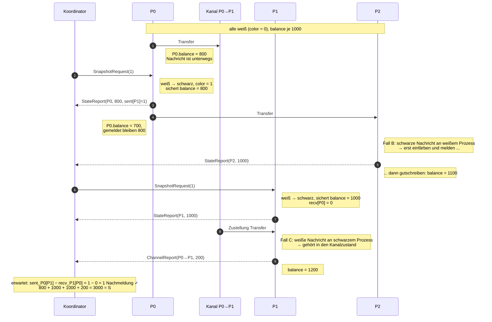

# Aufgabe 2 — Der Schnappschuss-Algorithmus (Variante (a): Koordinator / Einfärbeverfahren)

## Was gefordert war

Zur Laufzeit einen konsistenten globalen Zustand des Bankhauses erfassen, bestehend aus

1. dem **lokalen Zustand** jedes Prozesses (sein Kontostand zum Schnappschuss-Zeitpunkt) und
2. dem **Kanalzustand** jeder Verbindung (alle Überweisungen, die abgeschickt, aber noch nicht
   empfangen wurden).

Umzusetzen war Variante **(a)**, das Koordinator-/Einfärbeverfahren aus der Vorlesung, mit
expliziter Behandlung der Fälle der Nachrichten-Einfärbung. Für „schwarzer Prozess empfängt weiße
Nachricht" war eine der beiden Lösungsvarianten zu wählen **und zu begründen**. Die Annahmen des
Verfahrens sind festzuhalten, und es ist zu diskutieren, was die abgeschaltete FIFO-Zustellung
bedeutet. Am Ende gibt der Koordinator den vollständigen globalen Zustand aus.

## Der Algorithmus, wie ich ihn implementiert habe

### Farben

Jeder Prozess führt eine ganze Zahl `color` — die Anzahl der Schnappschüsse, die er bereits
aufgenommen hat. Bezüglich der laufenden Runde `k` heißt er

* **weiß**, solange `color < k` (er hat für Runde `k` noch nichts gemeldet),
* **schwarz**, sobald `color >= k`.

Eine ganze Zahl statt eines Booleschen Flags kostet nichts und erlaubt beliebig viele
Schnappschüsse hintereinander, ohne die Farben zurücksetzen zu müssen (ein Rücksetz-Multicast wäre
selbst wieder ein verteiltes Problem: währenddessen wären Prozesse unterschiedlich gefärbt).

**Jede Basisnachricht trägt die Farbe ihres Senders zum Sendezeitpunkt mit** — das ist die
Einfärbung der Nachricht:

```java
public record Transfer(long id, int amount, int senderColor) implements Message {}
```

### Ablauf

1. Der Koordinator schickt die Kontrollnachricht `SnapshotRequest(k)` — das `(state?, Farbe)` der
   Vorlesung — per Multicast an die Gruppe. (Realisiert als `n` gerichtete Sendungen mit jeweils
   eigener, zufälliger Latenz. Ein echter Multicast trifft die Empfänger ebenfalls nicht
   gleichzeitig; die gestaffelte Zustellung ist genau das, was den Algorithmus interessant macht.)
2. Ein Prozess färbt sich beim Empfang von weiß nach schwarz, notiert seinen lokalen Zustand und
   meldet ihn per `StateReport` an den Koordinator zurück.
3. Ein Prozess färbt sich **außerdem** ein, wenn ihn eine *schwarze Basisnachricht* erreicht,
   bevor die Kontrollnachricht des Koordinators eingetroffen ist (siehe Fall B).
4. Ein bereits schwarzer Prozess, der eine *weiße Basisnachricht* empfängt, meldet sie per
   `ChannelReport` nach: sie war zum Schnitt unterwegs (siehe Fall C).
5. Der Koordinator sammelt, bis er weiß, dass er alles hat (siehe „Abbruchbedingung"), und gibt
   den globalen Zustand aus.

Der lokale Zustand:

```java
public record StateReport(int color, String node, int balance,
                          Map<String,Integer> sentCount,
                          Map<String,Integer> receivedCount) implements Message {
    public StateReport {                     // Defensivkopie: der Prozess zählt weiter
        sentCount     = Map.copyOf(sentCount);
        receivedCount = Map.copyOf(receivedCount);
    }
}
```

`balance` ist der geforderte lokale Zustand. Die beiden Zähler sind Buchführung für die
Abbruchbedingung und werden weiter unten begründet.

## Die Fälle der Nachrichten-Einfärbung

Betrachtet wird eine Überweisung von `P_i` an `P_j`; `s` ist das Sendeereignis, `r` das
Empfangsereignis, `c_i` bzw. `c_j` sind die Schnitte (Einfärbezeitpunkte) der beiden Prozesse.

### Fall A — weiß → weiß (`s < c_i`, `r < c_j`)

Der Betrag ist beim Sender vor dessen Schnitt abgezogen und beim Empfänger vor dessen Schnitt
gutgeschrieben. Er steckt genau einmal in `P_j`s gemeldetem Saldo. Nichts zu tun.

### Fall B — schwarz → weiß: die *nachträgliche schwarze Basisnachricht*

`P_i` hat seinen Zustand bereits gemeldet und überweist *danach* (`s > c_i`). Der Betrag wurde
zwar von `P_i`s aktuellem Saldo abgezogen, **steckt aber noch in dem Saldo, den `P_i` gemeldet
hat**. Genau das meint die Aufgabenstellung mit „nachträgliche schwarze Basisnachrichten gehören
noch zum gemeldeten Zustand und müssen erfasst werden": ihr Geld ist im globalen Zustand bereits
enthalten — im Konto des Senders.

Trifft diese Nachricht auf einen noch weißen `P_j`, dann darf `P_j` sie **nicht** in seinen
gemeldeten Saldo aufnehmen. Täte er es, wäre der Betrag zweimal im globalen Zustand: einmal in
`P_i`s Meldung, einmal in `P_j`s. Und der Schnitt wäre inkonsistent — er enthielte das
Empfangsereignis `r`, nicht aber das kausal vorausgehende Sendeereignis `s`. Das ist die
„Nachricht aus der Zukunft".

Die Lösung ist die Regel des Verfahrens: **ein weißer Prozess, der eine schwarze Nachricht
erhält, färbt sich sofort ein und sichert seinen Zustand, bevor er die Nachricht verarbeitet.**
Die schwarze Nachricht wird dadurch zum Auslöser eines *nachträglichen* `StateReport`, noch bevor
die Kontrollnachricht des Koordinators eingetroffen ist. Sie ist danach eine schwarz→schwarz-
Nachricht und gehört **nicht** zum Kanalzustand.

```java
if (t.senderColor() > color) {
    takeSnapshotsUpTo(t.senderColor());   // erst einfärben und melden ...
}
...
balance += t.amount();                    // ... dann gutschreiben
```

Trifft die Kontrollnachricht des Koordinators später doch noch ein, läuft `takeSnapshotsUpTo`
leer — der Prozess ist bereits schwarz und meldet kein zweites Mal.

### Fall C — weiß → schwarz: die Nachricht *im Kanal*

`P_i` hat vor seinem Schnitt gesendet (`s < c_i`, sein gemeldeter Saldo ist bereits belastet),
`P_j` empfängt nach seinem Schnitt (`r > c_j`, sein gemeldeter Saldo kennt den Betrag nicht). Das
Geld ist in keinem gemeldeten Konto — es war zum Schnittzeitpunkt **unterwegs**. Das ist der
Kanalzustand des Kanals `P_i → P_j`, und genau das, was Punkt 2 der Aufgabe verlangt.

`P_j` meldet die Nachricht nach und verarbeitet sie ganz normal weiter:

```java
for (int c = t.senderColor() + 1; c <= color; c++) {
    transmit(new ChannelReport(c, sender, nodeName(), t.id(), t.amount()), coordinator);
}
receivedCount.merge(sender, 1, Integer::sum);
balance += t.amount();
```

### Fall D — schwarz → schwarz (`s > c_i`, `r > c_j`)

Der Betrag steckt in `P_i`s gemeldetem Saldo (Fall B), `P_j`s gemeldeter Saldo kennt ihn nicht.
Genau einmal gezählt. Nichts zu tun.

### Fall E — weiß gesendet, aber vor dem eigenen Schnitt empfangen, obwohl der Sender schon schwarz war

Existiert nicht — das ist der Punkt. Fall B verhindert, dass ein weißer Prozess eine schwarze
Nachricht *verarbeitet*. Damit ist der Schnitt konsistent.

### Warum die Summe stimmt

Jede Geldeinheit ist zu jedem Zeitpunkt an genau einer Stelle: in einem Konto oder in genau einer
Überweisung. Die vier Fälle zeigen, dass jede Überweisung im aufgezeichneten Zustand **genau
einmal** vorkommt — in Fall A und D im Konto (des Empfängers bzw. des Senders), in Fall C im
Kanal, und Fall E kann nicht auftreten. Also gilt

```
Σ gemeldete Kontostände + Σ Kanalinhalte = S
```

## Die gewählte Lösungsvariante für „schwarzer Prozess empfängt weiße Nachricht"

Zwei Varianten stehen zur Wahl:

**(1) Aufzeichnung beim Empfänger.** Der schwarze Prozess erkennt die weiße Nachricht an ihrer
Farbe, nimmt sie in den Kanalzustand auf und meldet sie dem Koordinator nach (`ChannelReport`).
Die Anwendung läuft ungestört weiter — die Überweisung wird ganz normal gutgeschrieben.

**(2) Buchführung beim Sender.** Jeder Prozess protokolliert die Basisnachrichten, die er vor
seinem Schnitt gesendet hat, und schickt das Protokoll mit dem `StateReport` mit. Der Koordinator
zieht davon ab, was der Empfänger vor seinem Schnitt schon empfangen hatte; der Rest ist der
Kanalinhalt.

**Ich habe (1) gewählt.** Die Begründung:

* **Ohne FIFO weiß nur der Empfänger, *welche* Nachricht noch unterwegs war.** Variante (2) liefert
  dem Koordinator eine Liste der vor dem Schnitt gesendeten Nachrichten und eine *Anzahl* der vor
  dem Schnitt empfangenen. Bei FIFO-Kanälen wäre das ausreichend: die empfangenen sind zwangsläufig
  die zuerst gesendeten, der Rest ist unterwegs. Unsere Kanäle sind aber nicht FIFO — Nachrichten
  überholen sich (zufällige Latenz je Nachricht) und werden zufällig aus der Warteschlange gewählt.
  Der Koordinator könnte nicht entscheiden, welche der protokollierten Nachrichten noch fliegt. Er
  bräuchte pro Nachricht eine Empfangsquittung — also mindestens so viele Kontrollnachrichten wie
  bei Variante (1), plus das Protokoll.
* **Der Zustand bleibt lokal, wo er entsteht.** In (1) meldet jeder Prozess nur, was er selbst
  beobachtet hat. In (2) müsste jeder Prozess die *Nutzlast* aller gesendeten Nachrichten
  aufheben, bis irgendwann ein Schnappschuss kommt — unbeschränkter Speicherbedarf, obwohl niemand
  weiß, ob je ein Schnappschuss ausgelöst wird.
* **Keine Blockade.** Eine gelegentlich genannte dritte Möglichkeit — der schwarze Prozess
  *verzögert* die Verarbeitung weißer Nachrichten bis zum Ende des Schnappschusses — verletzt die
  Anforderung, dass die Anwendung während des Schnappschusses weiterläuft, und kann bei knappen
  Salden Ketten von Prozessen blockieren.

Von Variante (2) übernehme ich allerdings die *Zählerbuchführung* — nicht für den **Inhalt** des
Kanals, sondern nur für die Frage, **wann der Schnappschuss vollständig ist**.

## Abbruchbedingung: wann ist der Schnappschuss vollständig?

Ein Koordinator, der nur `StateReport`s zählt, weiß nicht, wie viele `ChannelReport`s noch kommen.
Ohne FIFO gibt es auch keinen Marker, der einen Kanal „abschließt" (das ist gerade der Mechanismus,
den Chandy-Lamport benutzt und der FIFO braucht).

Jeder Prozess meldet deshalb zusätzlich zwei kumulierte Zähler zum Zeitpunkt seines Schnitts:
`sentCount[j]` = Anzahl der bis dahin an `j` gesendeten Überweisungen, `receivedCount[i]` = Anzahl
der bis dahin von `i` empfangenen. Der Koordinator rechnet für jeden gerichteten Kanal:

```
unterwegs(i → j) = sentCount_i[j] − receivedCount_j[i]
```

**Warum das stimmt, auch ohne FIFO.** Sei `A` die Menge der Überweisungen, die `i` vor seinem
Schnitt an `j` gesendet hat (`|A| = sentCount_i[j]`), und `B` die Menge derer, die `j` vor seinem
Schnitt von `i` empfangen hat (`|B| = receivedCount_j[i]`). Jede Nachricht in `B` wurde vor `j`s
Schnitt verarbeitet, war also weiß (Fall B garantiert: eine schwarze Nachricht hätte `j` zuerst
eingefärbt), wurde also vor `i`s Schnitt gesendet: `B ⊆ A`. Folglich sind genau `|A| − |B|`
Überweisungen unterwegs — unabhängig davon, in welcher Reihenfolge sie gesendet oder empfangen
wurden. Die Zähler sind ordnungsunabhängig; genau deshalb funktioniert das Argument ohne FIFO.

Der Koordinator sammelt also `n` `StateReport`s, berechnet daraus die erwartete Gesamtzahl der
Nachmeldungen und wartet auf genau so viele `ChannelReport`s. Weil keine Nachricht verlorengeht,
treffen sie alle ein — der Algorithmus terminiert. Die Nachmeldungen können auch *vor* der letzten
Zustandsmeldung eintreffen, deshalb sammelt der Koordinator beides in einer Schleife:

```java
while (states.size() < n || expected < 0 || channel.size() < expected) {
    ReceivedMessage rm = receive();
    switch (rm.message()) {
        case StateReport   sr when sr.color() == color -> states.put(sr.node(), sr);
        case ChannelReport cr when cr.color() == color -> channel.add(cr);
        default -> throw new IllegalStateException(...);
    }
    if (states.size() == n && expected < 0) expected = totalInTransit(states);
}
```

Zur Sicherheit prüft der Koordinator anschließend nicht nur die Summe, sondern **pro Kanal**, dass
die Zahl der Nachmeldungen exakt der aus den Zählern erwarteten entspricht (`verifyChannelCounts`).
In allen Läufen hat das gehalten.

## Konsequenzen der abgeschalteten FIFO-Zustellung

Das Übungsblatt weist ausdrücklich darauf hin, dass Chandy-Lamport FIFO-Kanäle voraussetzt. Für
die hier gewählte Variante (a) gilt:

* **Die Einfärbung reist in der Nachricht selbst, nicht als separater Marker.** Bei Chandy-Lamport
  trennt der Marker die Nachrichten „vor dem Schnitt gesendet" von „danach gesendet" — aber nur,
  wenn nichts den Marker überholen kann. Überholt eine *nach* dem Schnitt gesendete Basisnachricht
  den Marker, so verarbeitet der Empfänger sie vor seinem eigenen Schnitt: das Empfangsereignis
  läge im Schnitt, das Sendeereignis nicht. Genau der Fehler, den ein konsistenter Schnitt
  ausschließen muss.
* Beim Einfärbeverfahren kann die schwarze Nachricht die Kontrollnachricht des Koordinators
  beliebig überholen — sie **trägt ihre Farbe mit sich**. Der Empfänger sieht `senderColor > color`
  und färbt sich vor der Verarbeitung ein (Fall B). Der Schnitt bleibt konsistent. **Variante (a)
  braucht keine FIFO-Kanäle.**
* Für den *Inhalt* des Kanalzustands hat Nicht-FIFO trotzdem eine Konsequenz: der Sender kann nicht
  wissen, welche seiner Nachrichten noch unterwegs sind (nur wie viele). Deshalb die Aufzeichnung
  beim Empfänger, Variante (1) oben.
* Für die *Terminierung* hat Nicht-FIFO ebenfalls eine Konsequenz: „der zweite Marker beendet die
  Aufzeichnung des Kanals" funktioniert nicht mehr. Ersatz sind die ordnungsunabhängigen Zähler.

In der Simulation ist Nicht-FIFO doppelt erzwungen: durch die zufällige Latenz je Nachricht
(Nachrichten überholen sich auf dem Kanal) und durch
`SimulationBehavior.setMessageQueueSelectionDistributionFunction(RandomValues.getUniformDistribution())`
(der Empfänger zieht eine zufällige Nachricht aus seiner Warteschlange).

## Annahmen des Verfahrens

* **Keine Nachrichtenverluste.** Jede gesendete Nachricht kommt irgendwann an. Ohne das terminiert
  die Abbruchbedingung nicht — der Koordinator würde ewig auf eine Nachmeldung warten. (Das gilt
  für Chandy-Lamport genauso: ein verlorener Marker blockiert den Schnappschuss.)
* **Keine Abstürze.** Ein Prozess, der nach dem Sendeereignis stirbt, nimmt das Geld mit; ein
  Prozess, der vor dem `StateReport` stirbt, blockiert den Schnappschuss.
* **Endliche, aber unbeschränkte Latenz.** Kein Timeout-Verhalten nötig, aber jede Nachricht muss
  in endlicher Zeit ankommen.
* **Keine FIFO-Kanäle nötig** (siehe oben) — die Annahme, die Chandy-Lamport braucht, entfällt.
* **Statische, dem Koordinator bekannte Gruppe.** `n` ist fest; jeder Prozess kennt alle anderen.
* **Jeder Prozess verarbeitet Nachrichten fair.** Kein Prozess ignoriert seine Warteschlange
  dauerhaft (in sim4da durch die `engage()`-Schleife gegeben).
* **Farbe auf jeder Basisnachricht.** Alle Prozesse implementieren die Einfärbung; ein Prozess, der
  seine Nachrichten nicht färbt, macht den Schnitt unbrauchbar.
* Der Koordinator ist selbst **kein** Konto. Zwischen ihm und der Gruppe fließen nur
  Kontrollnachrichten, kein Geld — diese Kanäle sind nicht Teil des aufgezeichneten Zustands. Wäre
  der Koordinator zugleich ein Konto, müsste er sich wie jeder andere Prozess einfärben; am
  Algorithmus änderte sich nichts.

## Sequenzdiagramm eines konsistenten Schnitts

Drei Konten mit je 1000, `S = 3000`. Der Kanal `P0 → P1` ist als eigener Teilnehmer gezeichnet, um
die Zeit sichtbar zu machen, in der die Überweisung *unterwegs* ist.



Beachtenswert: `Transfer#2` ist **schwarz** und geht *nicht* in den Kanalzustand ein — sein Geld
steckt bereits in den gemeldeten 800 von `P0`. Hätte `P2` erst gutgeschrieben und dann gemeldet,
stünde dort 1100, die Gesamtsumme wäre 3100, und der Schnitt enthielte ein Empfangsereignis ohne
sein Sendeereignis.

## Ausgabe des vollständigen globalen Zustands

Der Koordinator gibt am Ende jeder Runde alle Kontostände **und** alle Kanalinhalte aus
(`n = 3`, gekürzt):

```
=== Konsistenter Schnappschuss (Runde/Farbe 1) ===
  Lokale Zustaende:
    P0   balance =    499
    P1   balance =    675
    P2   balance =   1189
  Kanalzustaende (unterwegs zum Schnittzeitpunkt):
    P0 -> P1     Transfer#50(2)  [Summe 2]
    P0 -> P2     Transfer#46(220)  [Summe 220]
    P1 -> P2     Transfer#45(174), Transfer#48(16), Transfer#43(141)  [Summe 331]
    P2 -> P0     Transfer#47(84)  [Summe 84]
  Summe Konten  : 2363
  Summe Kanaele : 637 (6 Ueberweisungen unterwegs)
  Gesamt        : 3000   (S = 3000)  -> INVARIANTE ERFUELLT
  Kontrollnachrichten: 12 (= 2n + 6 Nachmeldungen), Dauer 393 ms
```

Man sieht die einzelnen Überweisungen im Kanal, nicht nur ihre Summe — dafür trägt jede `Transfer`
eine `id`. `P1 → P2` enthält drei Nachrichten, deren `id`s (45, 48, 43) nicht aufsteigend sind:
die Nachrichten haben sich überholt.

## Inwiefern das die Aufgabe löst

* **Lokaler Zustand jedes Prozesses**: `StateReport.balance`, gesichert im Moment des Einfärbens,
  atomar gegenüber Senden und Empfangen (Einzel-Thread pro Knoten, siehe Aufgabe 1).
* **Kanalzustand jeder Verbindung**: die per `ChannelReport` nachgemeldeten weißen Nachrichten,
  pro gerichtetem Kanal gruppiert ausgegeben, mit Einzelnachrichten und Summe.
* **Variante (a), Koordinator/Einfärbeverfahren**: Multicast `(state?, Farbe)`, Farbwechsel
  weiß → schwarz, Zustand notieren, an den Koordinator melden.
* **Nachträgliche schwarze Basisnachrichten**: Fall B — ihr Geld ist im gemeldeten Saldo des
  Senders enthalten; der Empfänger färbt sich vor der Verarbeitung ein und schreibt sie *nicht*
  seinem gemeldeten Zustand zu.
* **„Schwarzer Prozess empfängt weiße Nachricht"**: Variante (1), Aufzeichnung beim Empfänger,
  begründet oben (Nicht-FIFO, lokaler Zustand, keine Blockade).
* **Annahmen und Nicht-FIFO**: eigene Abschnitte oben.
* **Ausgabe des vollständigen globalen Zustands durch den Koordinator**: siehe oben.

Der experimentelle Nachweis, dass der Schnitt konsistent ist, steht in [AUFGABE_3.md](AUFGABE_3.md).
