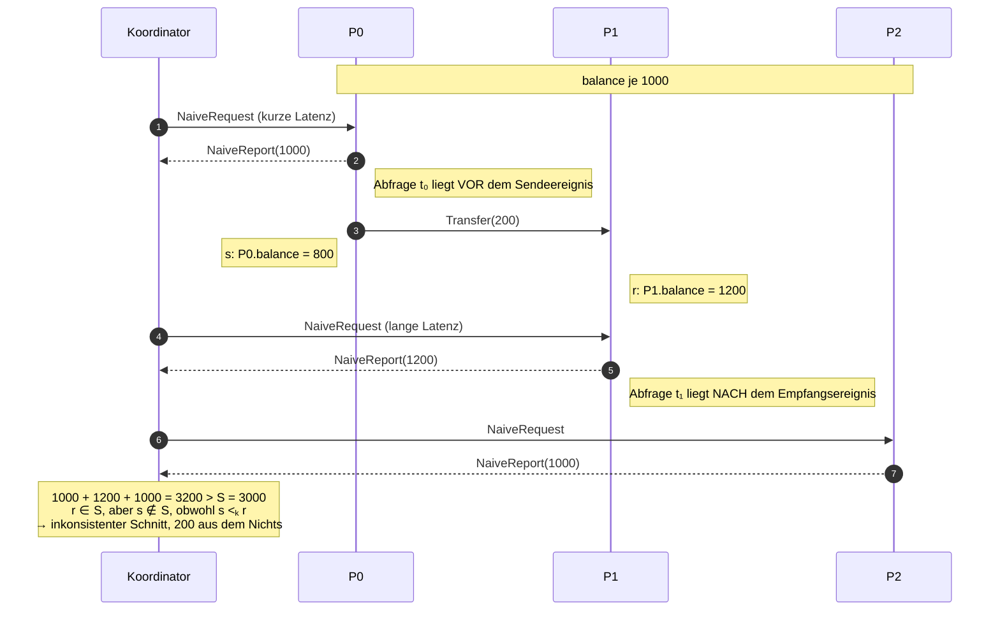

# Aufgabe 3 — Konsistenz nachweisen

## Was gefordert war

1. Schnappschüsse **während des laufenden Betriebs** auslösen und nachweisen, dass die erfasste
   Gesamtsumme (Konten + Kanäle) stets gleich `S` ist.
2. Einen **naiven** Schnappschuss implementieren (nur Kontostände, Kanäle ignoriert) und zeigen,
   dass er einen inkonsistenten globalen Zustand liefern kann. Den Zusammenhang mit dem konsistenten
   Schnitt (`e₂ ∈ S ∧ e₁ <ₖ e₂ ⇒ e₁ ∈ S`) erklären.
3. `n` und die Überweisungsfrequenz variieren, statistische Größen erfassen (z. B.
   Kontrollnachrichten pro Schnappschuss in Abhängigkeit von `n`), und die Nachteile von
   Schnappschuss-Algorithmen diskutieren.
4. Einen konsistenten und einen inkonsistenten Schnitt als Zeit-/Sequenzdiagramm visualisieren.

## Wie ich es gemessen habe

`src/bankhaus/ConsistencyExperiments.java` fährt zwei Messreihen. In beiden nimmt der Koordinator
pro Runde **zuerst einen naiven, direkt danach einen konsistenten Schnappschuss** auf — an
derselben Stelle des Betriebs, mit derselben Latenz, unter denselben Bedingungen. Die Prozesse
überweisen ununterbrochen weiter; nichts wird für den Schnappschuss angehalten.

```bash
cd bankhaus
./gradlew experiments
# oder: java -cp "out;lib/sim4da.jar" bankhaus.ConsistencyExperiments
```

Erzeugt `results/schnappschuesse.csv` und `results/naiv.csv`. Laufzeit ca. 4 Minuten.

Der naive Schnappschuss ist bewusst genau das, was die Aufgabe beschreibt, und nicht weniger:

```java
private boolean naiveSnapshot(int id) {
    multicast(new NaiveRequest(id));          // "Wie ist dein Kontostand?"
    int sum = 0, got = 0;
    while (got < n) {
        ReceivedMessage rm = receive();
        if (rm.message() instanceof NaiveReport nr && nr.id() == id) { sum += nr.balance(); got++; }
    }
    ...                                        // Kanäle: ignoriert
}
```

Ein Prozess beantwortet `NaiveRequest` sofort mit seinem aktuellen Saldo. Er färbt sich nicht ein,
er merkt sich nichts, und die Antworten werden zu unterschiedlichen Zeitpunkten erzeugt — jeder
Prozess wird abgefragt, wann ihn die Anfrage eben erreicht.

## 3.1 Die Invariante hält — 192 von 192 Schnappschüssen

Über beide Messreihen zusammen wurden **192 konsistente Schnappschüsse während des laufenden
Betriebs** aufgenommen. In **allen** gilt

```
Σ Kontostände + Σ Kanalinhalte = S
```

Zusätzlich prüft der Koordinator bei jedem Schnappschuss **pro gerichtetem Kanal**, dass die Anzahl
der eingegangenen Nachmeldungen exakt der aus den Zählern erwarteten Anzahl
`sentCount_i[j] − receivedCount_j[i]` entspricht (`verifyChannelCounts`). Auch das hat immer
gehalten. Der Schnappschuss zählt also nicht nur zufällig die richtige Summe, sondern erfasst genau
die richtigen Nachrichten.

Ein Ausschnitt aus `results/schnappschuesse.csv` (`n = 12`, hohe Frequenz):

| n | tickMax | runde | S | konten | kanäle | gesamt | konsistent | unterwegs |
|---|---|---|---|---|---|---|---|---|
| 12 | 40 ms | 1 | 12000 | 6256 | 5744 | 12000 | ✓ | 54 |
| 12 | 40 ms | 2 | 12000 | 5633 | 6367 | 12000 | ✓ | 55 |
| 12 | 40 ms | 3 | 12000 | 4434 | 7566 | 12000 | ✓ | 53 |

Über die Hälfte des gesamten Geldes war zum Schnittzeitpunkt unterwegs. Ein Schnappschuss, der die
Kanäle ignoriert, kann hier gar nicht richtig liegen.

## 3.2 Der naive Schnappschuss und der konsistente Schnitt

### Messergebnis

**Messreihe 1** (hohe Frequenz, 72 Schnappschüsse): **72 von 72** naiven Schnappschüssen weichen
von `S` ab, alle nach unten. Mittlere Abweichung:

| n | mittlere naive Abweichung |
|---|---|
| 3 | −898 (von S = 3000) |
| 5 | −1605 (von S = 5000) |
| 8 | −2169 (von S = 8000) |
| 12 | −3437 (von S = 12000) |

Bis zu einem Drittel des Geldes „verschwindet".

**Messreihe 2** (seltene Überweisungen, 400–900 ms Takt, 120 Schnappschüsse): jetzt sind die Kanäle
meist leer, und man sieht die beiden Fehlerarten getrennt.

| Ergebnis des naiven Schnappschusses | Anzahl |
|---|---|
| zufällig korrekt (`Σ = S`, Kanäle gerade leer) | 56 |
| Geld **verschwunden** (`Σ < S`) | 61 |
| Geld **entstanden** (`Σ > S`) | 3 |

Die konsistenten Schnappschüsse derselben 120 Runden waren ausnahmslos korrekt.

Die drei Fälle, in denen Geld entsteht (aus `results/naiv.csv`):

| seed | Schnappschuss | S | naive Summe | Abweichung |
|---|---|---|---|---|
| 15838 | 2 | 3000 | 3143 | **+143** |
| 39595 | 20 | 3000 | 3050 | **+50** |
| 47514 | 5 | 3000 | 3097 | **+97** |

### Warum beides passiert — und warum es zwei *verschiedene* Fehler sind

Der naive Koordinator fragt jeden Prozess `P_i` zu einem Zeitpunkt `t_i` ab. Weil die Anfragen
unterschiedlich lange unterwegs sind (und der Empfänger sie zufällig aus seiner Warteschlange
zieht), ist `t_i ≠ t_j`. Die Menge `S` der Ereignisse „vor der eigenen Abfrage" ist damit ein
beliebiger, **ungeprüfter Schnitt** durch die Ereignisse.

Betrachten wir eine Überweisung `b` von `P_i` an `P_j` mit Sendeereignis `s` (Konto belastet) und
Empfangsereignis `r` (Konto gutgeschrieben). Es gilt immer `s <ₖ r` — die Kausalordnung ist durch
die Nachricht gegeben.

* **`t_i > s` und `t_j < r`** — der Schnitt enthält `s`, aber nicht `r`. Das ist ein **konsistenter
  Schnitt** im Sinne von `e₂ ∈ S ∧ e₁ <ₖ e₂ ⇒ e₁ ∈ S`! Trotzdem ist der aufgezeichnete *Zustand*
  falsch: `b` ist beim Sender abgezogen und beim Empfänger noch nicht gutgeschrieben — es ist
  unterwegs, und der naive Schnappschuss erfasst den Kanalzustand nicht. **Geld verschwindet.**
  Der Fehler liegt nicht am Schnitt, sondern an der Unvollständigkeit des Zustands: ein globaler
  Zustand besteht aus Prozess- *und* Kanalzuständen.

* **`t_i < s` und `t_j > r`** — der Schnitt enthält `r`, aber nicht `s`. Das verletzt
  `e₂ ∈ S ∧ e₁ <ₖ e₂ ⇒ e₁ ∈ S` mit `e₁ = s`, `e₂ = r`: ein **inkonsistenter Schnitt**. Der
  Empfänger hat Geld gutgeschrieben bekommen, das der Sender aus Sicht des Schnitts noch gar nicht
  abgeschickt hat — eine **„Nachricht aus der Zukunft"**. **Geld entsteht.** Kein noch so guter
  Kanalzustand könnte diesen Zustand reparieren; der Schnitt selbst ist kein möglicher globaler
  Zustand des Systems.

Der zweite Fall ist seltener, weil er ein enges Zeitfenster braucht: die Anfrage muss `P_i` vor
dessen Sendeereignis und `P_j` nach dessen Empfangsereignis erreichen, d. h. `t_j − t_i` muss größer
sein als die Transportzeit der Überweisung. Bei unserer Latenzverteilung (40–200 ms für *alle*
Nachrichten, also auch für die Anfragen) kommt das vor, aber selten — 3 von 120.

**Genau diese beiden Fehler schließt das Einfärbeverfahren aus:**

* Der zweite (inkonsistenter Schnitt) wird durch **Fall B** verhindert: ein weißer Prozess, der eine
  schwarze Nachricht erhält, färbt sich *vor* der Verarbeitung ein. Ein Empfangsereignis kann nie
  in den Schnitt geraten, ohne dass sein Sendeereignis drin ist.
* Der erste (fehlender Kanalzustand) wird durch **Fall C** behoben: die weiße Nachricht, die einen
  schwarzen Prozess erreicht, wird als Kanalinhalt nachgemeldet.

Erst beides zusammen ergibt einen konsistenten globalen Zustand.

### Sequenzdiagramm: inkonsistenter Schnitt (naiv, „Geld entsteht")

`S = 3000`. Der Schnitt ist die gestrichelte Linie durch die drei Abfragezeitpunkte.



Der gespiegelte Fall (`t₀` nach dem Senden, `t₁` vor dem Empfang) liefert `800 + 1000 + 1000 = 2800`:
der Schnitt ist dann konsistent, aber die 200 im Kanal fehlen im Zustand.

Zum Vergleich das Sequenzdiagramm eines **konsistenten** Schnitts mit dem Einfärbeverfahren:
siehe [AUFGABE_2.md](AUFGABE_2.md#sequenzdiagramm-eines-konsistenten-schnitts). Dort tritt genau
die Situation aus dem oberen Diagramm auf — `P2` empfängt eine schwarze Nachricht, bevor die
Kontrollnachricht des Koordinators bei ihm ist — und wird korrekt behandelt: `P2` färbt sich ein
und meldet 1000, *bevor* er gutschreibt. Der Schnitt bleibt konsistent, die Summe stimmt.

## 3.3 n und Überweisungsfrequenz variieren

`tickMax` ist die obere Schranke der Wartezeit zwischen zwei Überweisungen: kleiner Wert = hohe
Frequenz. Jede Zeile ist der Mittelwert aus 6 Schnappschüssen (2 Läufe × 3 Runden).

| n | tickMax | Überweisungen unterwegs | Kontrollnachrichten | Dauer des Schnappschusses |
|---:|---:|---:|---:|---:|
| 3 | 40 ms | 13,7 | 19,7 | 412 ms |
| 3 | 80 ms | 6,2 | 12,2 | 415 ms |
| 3 | 160 ms | 3,0 | 9,0 | 367 ms |
| 5 | 40 ms | 21,8 | 31,8 | 453 ms |
| 5 | 80 ms | 10,2 | 20,2 | 458 ms |
| 5 | 160 ms | 6,2 | 16,2 | 414 ms |
| 8 | 40 ms | 34,8 | 50,8 | 464 ms |
| 8 | 80 ms | 17,0 | 33,0 | 447 ms |
| 8 | 160 ms | 10,0 | 26,0 | 394 ms |
| 12 | 40 ms | 54,0 | 78,0 | 492 ms |
| 12 | 80 ms | 25,2 | 49,2 | 456 ms |
| 12 | 160 ms | 13,3 | 37,3 | 427 ms |

### Was man daran abliest

**Kontrollnachrichten pro Schnappschuss = `2n + m`.** `n` Kontrollnachrichten `(state?, Farbe)` des
Koordinators, `n` Zustandsmeldungen zurück, und `m` Nachmeldungen — eine pro Überweisung, die zum
Schnitt unterwegs war. Die Tabelle bestätigt das exakt (z. B. `n = 12`, `tickMax = 40`:
`24 + 54 = 78`).

**`m` ist der dominierende Term.** `m` hängt nicht nur von `n` ab, sondern vom Produkt aus
Überweisungsrate und Latenz — bei `n = 12` und hoher Frequenz sind mehr als doppelt so viele
Nachmeldungen unterwegs wie fixe Kontrollnachrichten. Der Aufwand eines Schnappschusses skaliert
also mit der *Aktivität* des Systems, nicht nur mit seiner Größe. Halbiert man die
Überweisungsfrequenz, halbiert sich `m` (13,7 → 6,2 → 3,0 bei `n = 3`), während `2n` konstant bleibt.

**Die Dauer ist praktisch konstant** (367–492 ms) und wird von der Latenz bestimmt, nicht von `n`:
Kontrollnachricht hin (Ø 120 ms), Meldung zurück (Ø 120 ms), plus die Wartezeit auf die letzte
Nachmeldung (bis zu 200 ms nach ihrer Zustellung). Der Schnappschuss wird mit wachsendem `n` also
nicht langsamer, aber teurer.

### Die Nachteile von Schnappschuss-Algorithmen

**Hohes Nachrichtenaufkommen.** Selbst der günstige Fall kostet `2n` Kontrollnachrichten plus eine
Nachmeldung je unterwegs befindlicher Basisnachricht — bei `n = 12` und hoher Last 78
Kontrollnachrichten für *einen* Schnappschuss, während in derselben Zeit nur einige hundert
Basisnachrichten fließen. Der Schnappschuss ist damit kein „Nebenbei"-Vorgang.

Zum Vergleich: **Chandy-Lamport** wäre hier deutlich teurer. Jeder Prozess schickt über *jeden*
ausgehenden Kanal einen Marker, also `n(n−1)` Marker allein für die Kanalabgrenzung — bei `n = 12`
sind das 132 Marker statt `2n = 24` Kontrollnachrichten, plus das Einsammeln der Teilzustände.
Dafür braucht Chandy-Lamport keinen Koordinator — und, entscheidend hier, **FIFO-Kanäle**, die wir
absichtlich nicht haben (siehe [AUFGABE_2.md](AUFGABE_2.md#konsequenzen-der-abgeschalteten-fifo-zustellung)).

**„Nicht verteilt genug".** Das Koordinatorverfahren hat einen ausgezeichneten Prozess:

* Er ist ein **Engpass**: alle `n` Zustandsmeldungen und alle `m` Nachmeldungen laufen bei ihm
  zusammen. Sein Eingangs-Nachrichtenaufkommen wächst mit `n` *und* mit der Systemlast, während
  jeder andere Prozess konstant wenig zu tun hat.
* Er ist ein **Single Point of Failure**: fällt er aus, kommt kein Schnappschuss zustande, und die
  bereits schwarz gefärbten Prozesse bleiben schwarz.
* Er kennt die **Gruppenmitgliedschaft** vollständig und statisch — in einem echten verteilten
  System ist genau das eine der schwierigen Annahmen.
* Der aufgezeichnete Zustand existiert am Ende **nur bei ihm**. Kein Prozess kennt den globalen
  Zustand, an dem er selbst beteiligt war.

**Der Schnappschuss ist nie „jetzt".** Der aufgezeichnete Zustand hat zu keinem Zeitpunkt real
existiert — er ist ein möglicher Zustand, ein Punkt auf einem äquivalenten Ablauf. Für Invarianten
(„Geld geht nicht verloren"), Deadlock-Erkennung oder Terminierungserkennung reicht das; für
Aussagen über „den Zustand vor 400 ms" nicht.

**Der Speicherbedarf ist unbeschränkt**, wenn Nachmeldungen und Zustände über mehrere gleichzeitige
Schnappschuss-Runden gehalten werden müssen. Unsere Implementierung startet eine Runde erst, wenn
die vorige vollständig ist — das begrenzt es, kostet aber Parallelität.

## Inwiefern das die Aufgabe löst

* **(1)** 192 Schnappschüsse während des laufenden Betriebs, alle mit `Konten + Kanäle = S`;
  zusätzlich pro Kanal verifiziert, dass genau die erwarteten Nachrichten nachgemeldet wurden.
* **(2)** Naiver Schnappschuss implementiert (`SnapshotCoordinator.naiveSnapshot`), gemessen: 61×
  Geld verschwunden, 3× Geld entstanden, 56× zufällig korrekt. Der Zusammenhang mit
  `e₂ ∈ S ∧ e₁ <ₖ e₂ ⇒ e₁ ∈ S` ist oben ausgeführt — inklusive der Unterscheidung zwischen einem
  *inkonsistenten Schnitt* (Geld entsteht) und einem *konsistenten Schnitt mit unvollständigem
  Zustand* (Geld verschwindet).
* **(3)** `n ∈ {3, 5, 8, 12}` × Überweisungsfrequenz ∈ {40, 80, 160 ms}, Kontrollnachrichten,
  Nachmeldungen und Dauer je Schnappschuss erfasst und diskutiert; Nachteile (Nachrichtenaufkommen,
  „nicht verteilt genug") oben behandelt.
* **(4)** Sequenzdiagramm des inkonsistenten Schnitts oben, des konsistenten Schnitts in
  [AUFGABE_2.md](AUFGABE_2.md#sequenzdiagramm-eines-konsistenten-schnitts).

## Rohdaten

* `results/schnappschuesse.csv` — eine Zeile je Schnappschuss der Messreihe 1
  (`n, tickMaxMs, seed, runde, S, konten, kanaele, gesamt, konsistent, unterwegs,
  kontrollnachrichten, dauerMs, naivSumme, naivAbweichung, basisnachrichten`)
* `results/naiv.csv` — eine Zeile je Schnappschuss der Messreihe 2
  (`seed, schnappschuss, S, naivSumme, naivAbweichung, konsistentGesamt, unterwegs`)
