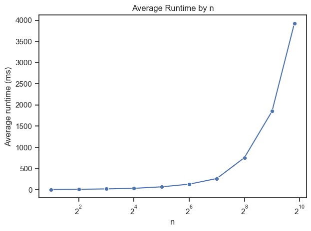
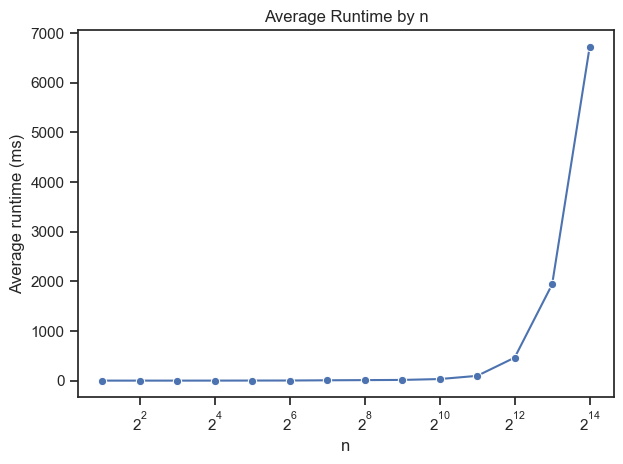

# Bericht Übungsblatt 1 - Verteilte Systeme 2026

## Aufgabe 1
Für die Implementierung von Aufgabe 1 habe ich mir zuerst die Grobe funktionsweise von 
UDP durch Codex erklären lassen, da ich vorher noch keine Berührungspunkte mit 
Übertragungsprotokollen hatte. Für mich war es wichtig, erst einmal zu verstehen,
wie eine Verbindung zwischen 2 Rechnern aufgebaut wird und wie Nachrichten verschickt werden.

Ich habe mir dann mit Hilfe von Codex eine kleine Klasse UdpEndpoint.java erstellt, die
bei initialisierung einen Socket auf dem gegebenen localport öffnet und Methoden für send
und receive implementiert. Die Pakete die hin und hergeschickt werden können sind einfache
Records bestehend aus einem String und der Adresse des Senders.

Auf dem UdpEndpoint baut die RingNode auf. Jeder Teilnehmer des Tokenrings wird durch eine
Klasse RingNode.java dargestellt. Die RingNode besteht im Wesentlichen aus einem Main Loop, der 
kontinuierlich auf ein neues Receive wartet. Bevor die receive Schleife startet initialisiert die
RingNode ihren UdpEndpoint sowie einen Multicast Listener, der auf gesendete Multicasts von 
anderen Nodes wartet. Wenn der Node der Boolean Flag "startsWithToken" übergeben wurde,
signalisiert das der Node, dass sie den Anfang macht.

Der Token der herumgereicht wird ist eine kleine Record Struktur die einige Metadaten und Node 
übergreifende Informationen speichern kann. Der Token hat somit vollständiges Wissen über die
Runde und das Netzwerk und kann als Terminierungssignal genutzt werden, indem die Anzahl stiller 
Runden in den Token reingeschrieben wird.

Nach initialisierung durchläuft jede Node denselben Prozess: 

Warte auf Token -> Wenn kein Stop signal erhalten -> Reiche Token weiter -> Wenn wieder bei der
Start Node angekommen -> Runde abschließen, Metriken loggen -> Prüfen ob k Runden still waren 
-> neue Runde starten oder terminieren

Wenn Stop signal erhalten -> Versende Token mit Stop signal an nächste Node

Da ich einige Probleme hatte die laufenden Java Prozesse vollständig zu terminieren und belegte 
Ports wieder freizugeben, habe ich eine kleine Besonderheit in den Ring implementiert. Das Stop
Signal wird normal von Node zu Node weitergereicht. Wenn aber die erste Node das Stopsignal erhält
feuert diese nochmal einen extra Multicast, der ein Stop signal erhält. Sobald eine Node dieses 
Signal erhält weiß sie, dass der Ring beendet wurde und die Node terminiert sauber und gibt ihren
Port frei. Das war besonders hilfreich als ich mehrere Experimente hintereinander laufen gelassen 
habe und immer wieder dieselbe Port Range recycelt habe. So sind die Ports immer pünktlich frei
gewesen und alle Java Prozesse waren zum Start des neuen Experiments terminiert.

Der Rest der RingNode Klasse enthält einige logging Funktionen zum Tracken der Statistiken. Das habe
ich mir vollständig mit Codex generieren lassen.

Ebenso mit Codex generiert ist das Python Skript, um das Tokenring Experiment mehrfach auszuführen.

Ich habe ein maximales n = 896 geschafft. Das habe ich mit 32 gig Ram gerade so geschafft. Dabei hatte 
jeder Java Prozess (also jede Node) einen zugewiesenen Heap in Höhe von 9 MB. Das macht in etwa 8 gig Ram
für alle Nodes zusammen. Entweder braucht die JVM so viel overhead, dass ich nur ein Viertel meines Rams
für die tatsächlichen Prozesse nutzen konnte oder ich habe einen Fehler im Aufrufen der Prozesse mit den
Heap zuweisungen. Ich habe extra darauf geachtet keine anderen Speicherintensiven Anwendungen laufen zu lassen. 
Alle n wurden jeweils 10-mal hintereinander mit zufälligen Seeds durchgeführt. 
Für alle Experimente wurde p = 0.5 und k = 3 gewählt

Auffällig war, dass die Multicasts im Schnitt in etwa der Anzahl der Nodes entsprechen. Erst ab 128 Nodes
habe ich die Laufzeit deutlich gespürt. 

Die Ergebnisse sind in der folgenden Tabelle zu sehen:

| n   | runs | roundsMin | roundsMax | roundsMean | avgMsPerRound | multicastsMin | multicastsMax | multicastsMean | durationSecondsMin | durationSecondsMax | durationSecondsMean | heapMbPerNode |
|-----|------|-----------|-----------|------------|---------------|---------------|---------------|----------------|--------------------|--------------------|---------------------|---------------|
| 2   | 10   | 3         | 7         | 5.3        | 6.1608        | 0             | 4             | 1.8            | 0.25               | 0.391              | 0.277               | 4096          |
| 4   | 10   | 4         | 8         | 6          | 10.9183       | 1             | 7             | 3.5            | 0.297              | 0.469              | 0.378               | 2048          |
| 8   | 10   | 5         | 9         | 6.5        | 20.4440       | 4             | 12            | 7.6            | 0.485              | 0.578              | 0.536               | 1024          |
| 16  | 10   | 7         | 10        | 8.3        | 33.5493       | 12            | 20            | 15.5           | 0.828              | 1.046              | 0.909               | 512           |
| 32  | 10   | 6         | 11        | 8.7        | 69.5166       | 28            | 38            | 34             | 1.562              | 1.813              | 1.672               | 256           |
| 64  | 10   | 6         | 13        | 10         | 131.9233      | 47            | 74            | 59.9           | 3.11               | 3.829              | 3.305               | 128           |
| 128 | 10   | 10        | 16        | 11.8       | 265.3232      | 111           | 147           | 127.2          | 6.61               | 7.906              | 7.261               | 64            |
| 256 | 10   | 9         | 15        | 11.5       | 758.1629      | 238           | 297           | 256.2          | 15.594             | 17.594             | 16.25               | 32            |
| 512 | 10   | 10        | 16        | 12.6       | 1853.0518     | 488           | 535           | 514            | 37.828             | 43.39              | 39.8                | 16            |
| 896 | 10   | 11        | 17        | 13.9       | 3925.0974     | 850           | 938           | 903.1          | 80.546             | 85.172             | 82.437              | 9             |

Die einzelnen Durchläufe hatten eine schnell steigende durchschnittliche Laufzeit. Der Plot zeigt das ganz gut bei
logarithmisch skalierter x-Achse.

## Aufgabe 2

Wir haben zu dritt versucht Aufgabe 2 im CIP Pool mit ca. 27 Rechnern zu lösen. Dafür haben wir auf allen Rechnern die
RingNode Logik verteilt und ausgeführt. Es gab einen Master Rechner der Node Index 0 hatte und den Ring starten sollte.
Leider konnten wir aufgrund fehlender Admin Rechte keinen Netzwerkzugriff für Python freigeben. Deswegen ist unser Experiment
im CIP Pool leider gescheitert.

Zuhause konnte ich das Experiment immerhin auf 2 Physischen Rechnern durchführen. Dafür habe ich das Runner Skript von Codex
anpassen lassen, sodass Node 0 auf die anderen Nodes wartet. In diesem Fall leider trivial mit 2 Rechnern. Dementsprechend
sind die Ergebnisse auch nicht sonderlich spannend. Die nachfolgende Tabelle zeigt den Durchschnitt über 10 Runden. An der 
RingNode Logik wurde im Vergleich zu Aufgabe 1 nichts verändert.

| n | runs | roundsMin | roundsMax | roundsMean | minMs | avgMsPerRound | maxMs   | multicastsMin | multicastsMax | multicastsMean | durationSecondsMin | durationSecondsMax | durationSecondsMean | heapMbPerNode |
|---|------|-----------|-----------|------------|-------|---------------|---------|---------------|---------------|----------------|--------------------|--------------------|---------------------|---------------|
| 2 | 10   | 3         | 8         | 4.7        | 3.963 | 12.2125       |  47.066 | 0             | 3             | 1.5            | 0.235              | 0.922              | 0.353               | 512           |

Auffällig ist hier, dass die Rundenlaufzeit deutlich Stärker schwankt als bei dem Pseudo-verteilten Durchlauf.

## Aufgabe 3

Die Implementierung von Aufgabe 3 ist recht einfach gewesen, da die Logik und Strukturen aus Aufgabe 1 quasi unverändert
wiederverwendet werden konnten. RingNode und Token wurden auf das entsprechende sim4da Objekt gemapped. Der main Loop
ist in den engage loop der Node gewandert und kann dort laufen. Anstelle der Zuweisung eines eigenen UdpEndpoints
werden die Nodes jetzt von der sim4da internen NetworkConnection gemanaged.

Durch die Verwendung der Simulation konnte ein deutlich höheres n = 16384 erzielt werden. Das Limit war hierbei nicht mehr
der Speicher, sondern meine CPU. Ich habe das ganze auf einem Intel Core i7 9700K @4.7GHz zum Laufen gebracht. Das hat 
auch zu durchgehend 98% CPU Auslastung geführt. Erstmals gabs hier dann auch Timeouts (bei timeout=120s), da das ganze Netzwerk
zu lange gebraucht hat, um zu terminieren. Wieder entsprechen die Multicasts in etwa der Anzahl an Nodes bei denselben
Parametern (p=0.5, k=3) wie zuvor.

Bis 1024 Nodes war die Laufzeit quasi nicht merklich. Danach steigt die Laufzeit, wie auch bei den anderen Experimenten
exponentiell an.

| n     | runs | failedRuns | roundsMin | roundsMax | roundsMean | multicastsMin | multicastsMax | multicastsMean | minMsMin | minMsMax | minMsMean | avgMsMin | avgMsMax | avgMsMean | maxMsMin  | maxMsMax  | maxMsMean | durationSecondsMin | durationSecondsMax | durationSecondsMean |
|-------|------|------------|-----------|-----------|------------|---------------|---------------|----------------|----------|----------|-----------|----------|----------|-----------|-----------|-----------|-----------|--------------------|--------------------|---------------------|
| 2     | 10   | 0          | 3         | 8         | 4.4        | 0             | 4             | 1.7            | 0.081    | 0.103    | 0.092     | 0.745    | 2.083    | 1.48      | 5.017     | 6.159     | 5.621     | 0.078              | 0.109              | 0.089               |
| 4     | 10   | 0          | 4         | 7         | 5.8        | 2             | 5             | 3.4            | 0.145    | 0.195    | 0.178     | 1.035    | 1.886    | 1.322     | 5.342     | 8.91      | 6.455     | 0.078              | 0.11               | 0.091               |
| 8     | 10   | 0          | 5         | 9         | 6.6        | 4             | 12            | 7.6            | 0.321    | 0.367    | 0.348     | 1.173    | 2.615    | 1.55      | 6.015     | 11.194    | 7.388     | 0.078              | 0.109              | 0.095               |
| 16    | 10   | 0          | 7         | 11        | 8.1        | 13            | 24            | 18.5           | 0.541    | 0.774    | 0.617     | 1.44     | 2.506    | 1.72      | 6.317     | 11.736    | 8.103     | 0.093              | 0.109              | 0.095               |
| 32    | 10   | 0          | 6         | 11        | 8.2        | 24            | 38            | 29.7           | 0.46     | 1.387    | 0.888     | 2.033    | 4.014    | 2.802     | 9.812     | 13.327    | 11.206    | 0.093              | 0.125              | 0.113               |
| 64    | 10   | 0          | 7         | 12        | 10         | 56            | 70            | 63.6           | 0.386    | 0.865    | 0.54      | 2.67     | 4.288    | 3.499     | 13.967    | 38.282    | 20.577    | 0.109              | 0.5                | 0.159               |
| 128   | 10   | 0          | 10        | 13        | 11.4       | 117           | 150           | 131.5          | 0.161    | 0.82     | 0.527     | 3.957    | 16.451   | 7.974     | 28.062    | 83.227    | 47.709    | 0.14               | 0.609              | 0.241               |
| 256   | 10   | 0          | 10        | 13        | 12         | 235           | 277           | 257.1          | 0.436    | 0.723    | 0.547     | 8.348    | 17.275   | 11.629    | 70.437    | 159.457   | 100.194   | 0.203              | 0.297              | 0.252               |
| 512   | 10   | 0          | 11        | 15        | 12.7       | 493           | 544           | 520.9          | 0.88     | 1.112    | 0.965     | 12.169   | 19.681   | 15.414    | 113.678   | 168.539   | 132.803   | 0.265              | 0.36               | 0.292               |
| 1024  | 10   | 0          | 12        | 16        | 13.6       | 992           | 1078          | 1032.9         | 1.16     | 1.834    | 1.346     | 27.137   | 39.651   | 32.929    | 214.61    | 303.888   | 253.466   | 0.485              | 0.61               | 0.55                |
| 2048  | 10   | 0          | 12        | 17        | 14.5       | 1990          | 2092          | 2040.8         | 1.605    | 2.653    | 2.123     | 81.922   | 119.502  | 97.429    | 696.345   | 834.686   | 752.932   | 1.438              | 1.844              | 1.547               |
| 4096  | 10   | 0          | 15        | 19        | 15.9       | 3949          | 4161          | 4073.6         | 4.269    | 5.991    | 4.645     | 383.295  | 516.147  | 464.685   | 3312.267  | 3938.549  | 3530.917  | 6.89               | 7.907              | 7.514               |
| 8192  | 10   | 0          | 16        | 19        | 17         | 8029          | 8301          | 8185.4         | 8.792    | 9.617    | 9.117     | 1705.154 | 2124.764 | 1941.284  | 15760.873 | 17160.756 | 16524.173 | 32.125             | 34.36              | 33.069              |
| 16384 | 10   | 6          | 16        | 19        | 17.5       | 16202         | 16524         | 16414.5        | 17.52    | 19.345   | 18.514    | 6199.459 | 7366.819 | 6719.197  | 56272.136 | 59406.579 | 57711.912 | 116.172            | 118.25             | 117.512             |

## Vergleich Aufgaben 1 - 3

Aufgabe 1 hatte für mich den höchsten Experimentalaufwand, da ich Udp verstehen musste, die korrekte und vollständige
Terminierung von Javaprozessen und die Portfreigabe sicherstellen musste. Im Gegensatz dazu war Aufgabe 3 ein Kinderspiel,
da nur noch die Logik auf den Simulator gemapped werden musste. Mit Codex war das trivial. Aufgabe 2 hat uns als Gruppe viel
Zeit gekostet und ist leider ohne Ergebnis geblieben. Bei mir Zuhause war Aufgabe 2 eine Sache von 5 Minuten und 2 sauberen
Prompts.

Besonders stark fällt natürlich auf, dass das Experiment im Simulator um Faktor 20 höher skaliert werden konnte. Auch auffällig
war für mich, dass der Simulator sehr wenig Speicherbedarf hat. Im Gegensatz dazu brauchen die 896 JVMs das letzte Quäntchen
Ram, was ich im Rechner hab. Die starken Schwankungen in der Rundenzeit bei Aufgabe 2 fand ich auch sehr interessant. 
Der physische Weg übers Netzwerk hat offensichtlich deutlich mehr Hindernisse/Latenz und braucht im Schnitt doppelt so
lang pro Runde wie der Experiment-Aufbau auf einem Rechner.

Die Implementierung war durch Codex recht gut machbar, auch wenn ich einige Prompts gebraucht habe, um klarzustellen, dass
ich eine simple und einfach zu verstehende Lösung möchte. Generell fällt mir beim Entwickeln mit der KI - auch in anderen 
Projekten - oft auf, dass sie dazu neigt existierende APIs zu ignorieren und lieber eine eigene Methode schreibt, die die 
Implementierung und Logik der API kopiert, statt einfach den Endpoint direkt zu nutzen.

## Aufgabe 4

Es gibt einige Konsistenzkriteriern, die für die Implementierung aus Aufgabe 3 definiert werden können:

Tokenbasierte Konsistenzen:
1. Es darf zu jeder Zeit ausschließlich ein Token im Umlauf sein.
2. Der Ring muss die Reihenfolge einhalten → Der Token muss in korrekter Reihenfolge weitergereicht werden.
3. Pro Runde darf jede Node den Token nur einmal sehen und verarbeiten.

Da der Token sowieso schon einige Informationen über den Netzwerkzustand speichert, ist es günstig ihm weitere Metadaten
anzuhängen mit denen diese Konsistenzkriterien überprüft und eingehalten werden können.

Als Erstes bekommt der Token eine eindeutige ID, die jede Runde neu vergeben wird. Jede Node speichert die gesehenen Tokens
in einem Set. Damit kann jede Node überprüfen, ob der aktuelle Token bereits bei ihr war. Wird also ein neuer Token mit 
gleicher ID generiert, so sollte dieser erkannt werden und dann einfach nicht behandelt werden. Über die hops die der 
Token gemacht hat kann ausgerechnet werden welcher Node Index der korrekte/der erwartete Index ist. Nur wenn der
erwartete Index dem Node Index entspricht darf die Node den Token verarbeiten. Andernfalls können wir davon ausgehen,
dass die Reihenfolge nicht eingehalten wurde.

Darüber hinaus können wir einige Konsistenzen über die Terminierung definieren:
1. Die Methode completeRound() darf nur von Node 0 aufgerufen werden und auch nur dann, wenn die hops des Tokens der 
Anzahl an Nodes entsprechen.
2. Nodes erhalten ein stopped flag -> Nachdem sie das stopped flag erhalten haben verarbeiten sie keine Tokens oder
Fireworks mehr.
3. Nodes merken sich die höchste Runde. Ein Firework mit höherer Runde ist verspätet und wird gemeldet und nicht verarbeitet.
4. Nodes merken sich das Firework pro Runde. Sollte dasselbe Firework nochmal kommen wird das als inkonsistent gemeldet.

Mit Hilfe von Codex konnte ich die Konsistenzkriterien schnell implementieren. 
Codex hat mir darüber hinaus freundlicherweise eine kleine Klasse ConsistencyMonitor gebaut, die die Inkonsistenzen, sollte es denn 
welche geben, tracked und am Ende reported.

Ein kleines Experiment auf dem Simulator bis n = 1024 zeigt keine gemeldeten Inkonsistenzen:

| n    | runs | failedRuns | roundsMin | roundsMax | roundsMean | consistencyWarningsMin | consistencyWarningsMax | consistencyWarningsMean | multicastsMin | multicastsMax | multicastsMean | minMsMin | minMsMax | minMsMean | avgMsMin | avgMsMax | avgMsMean | maxMsMin | maxMsMax | maxMsMean | durationSecondsMin | durationSecondsMax | durationSecondsMean |
|------|------|------------|-----------|-----------|------------|------------------------|------------------------|-------------------------|---------------|---------------|----------------|----------|----------|-----------|----------|----------|-----------|----------|----------|-----------|--------------------|--------------------|---------------------|
| 2    | 10   | 0          | 3         | 7         | 5.2        | 0                      | 0                      | 0                       | 0             | 5             | 2.3            | 0.086    | 0.121    | 0.1       | 2.04     | 3.467    | 2.379     | 6.038    | 13.513   | 11.686    | 0.078              | 0.11               | 0.1                 |
| 4    | 10   | 0          | 4         | 7         | 5.6        | 0                      | 0                      | 0                       | 1             | 5             | 4.2            | 0.17     | 0.193    | 0.181     | 1.78     | 3.356    | 2.382     | 11.108   | 13.401   | 12.026    | 0.078              | 0.109              | 0.092               |
| 8    | 10   | 0          | 5         | 12        | 7.3        | 0                      | 0                      | 0                       | 6             | 12            | 8.5            | 0.345    | 0.399    | 0.371     | 1.443    | 2.902    | 2.297     | 12.323   | 14.578   | 13.218    | 0.079              | 0.11               | 0.095               |
| 16   | 10   | 0          | 6         | 10        | 8.1        | 0                      | 0                      | 0                       | 10            | 20            | 15.2           | 0.562    | 0.817    | 0.706     | 2.043    | 3.088    | 2.479     | 12.425   | 14.202   | 13.509    | 0.093              | 0.109              | 0.097               |
| 32   | 10   | 0          | 7         | 11        | 9.3        | 0                      | 0                      | 0                       | 27            | 38            | 32.3           | 0.881    | 1.509    | 1.084     | 2.844    | 4.058    | 3.285     | 15.54    | 17.272   | 16.305    | 0.093              | 0.11               | 0.108               |
| 64   | 10   | 0          | 7         | 11        | 8.7        | 0                      | 0                      | 0                       | 54            | 78            | 64.3           | 0.718    | 1.154    | 0.902     | 4.06     | 6.401    | 5.092     | 22.333   | 28.251   | 25.546    | 0.109              | 0.125              | 0.122               |
| 128  | 10   | 0          | 9         | 12        | 10.6       | 0                      | 0                      | 0                       | 112           | 150           | 131.4          | 0.46     | 0.808    | 0.57      | 5.513    | 7.205    | 6.278     | 41.997   | 48.223   | 44.635    | 0.14               | 0.156              | 0.145               |
| 256  | 10   | 0          | 10        | 14        | 11.8       | 0                      | 0                      | 0                       | 245           | 276           | 256.9          | 0.51     | 0.683    | 0.579     | 7.635    | 10.764   | 8.969     | 70.778   | 84.154   | 76.806    | 0.172              | 0.204              | 0.189               |
| 512  | 10   | 0          | 12        | 16        | 12.7       | 0                      | 0                      | 0                       | 486           | 534           | 512.2          | 0.954    | 1.106    | 1.019     | 12.626   | 16.923   | 14.791    | 114.695  | 151.008  | 131.938   | 0.25               | 0.297              | 0.278               |
| 1024 | 10   | 0          | 13        | 16        | 14         | 0                      | 0                      | 0                       | 1012          | 1042          | 1029.3         | 1.088    | 2.115    | 1.437     | 27.997   | 36.424   | 30.899    | 221.235  | 304.981  | 254.988   | 0.5                | 0.609              | 0.542               |

Die Aufgabenstellung schreit nach ja förmlich nach Fangfrage also habe ich spaßeshalber Codex noch einen kleinen Check über die
Implementierung von sim4da laufen lassen, ob er dort mögliche Inkonsistenzen findet. Siehe da :)

**_Codex Output Start_**

Kurzbefund zum sim4da-Paket:
Network.broadcast: Kritisch. Es wird ein einziges mutable Message-Objekt erzeugt und für alle Empfänger wiederverwendet;
raw.receiver_id = l wird im Loop verändert. Dadurch können Queues dieselbe Message-Instanz mit nachträglich falschem receiver_id sehen.

MessageQueue.await: Nachrichten werden absichtlich zufällig aus der Queue entfernt, also keine FIFO-Garantie. 
Für Protokolle, die Reihenfolge erwarten, kann das inkonsistente Sichten erzeugen.

MessageQueue.stop: stop ist nicht volatile und wird außerhalb synchronisierter Blöcke gelesen. Potenzielles 
Sichtbarkeitsproblem zwischen Threads.

Simulator.stillSimulating: is_simulating ist ebenfalls nicht volatile. Nodes könnten theoretisch einen alten Wert sehen.

Simulator.runSimulation: Die Simulation endet zeitbasiert und ruft dann network.stop() auf. Noch wartende oder zugestellte 
Nachrichten können dadurch unvollständig verarbeitet werden.

**_Codex Output Ende_**

Warum findet ConsistencyMonitor dann keine Inkonsistenzen im Experiment?
- Ein Mutable Broadcast interessiert uns für die korrekte Tokenweitergabe nicht, da der Token mit send (Unicast) weitergegeben wird.
- Dass die FiFo Eigenschaft sabotiert wird, ist nicht unbedingt schlimm, da der Token den Netzwerkzustand kennt und speichert.
Ob eine Node jetzt zuerst das Firework sieht und danach den Token oder umgekehrt macht da keinen Unterschied, weil die 
Konsistenzkriterien vom Token vorgehalten werden.