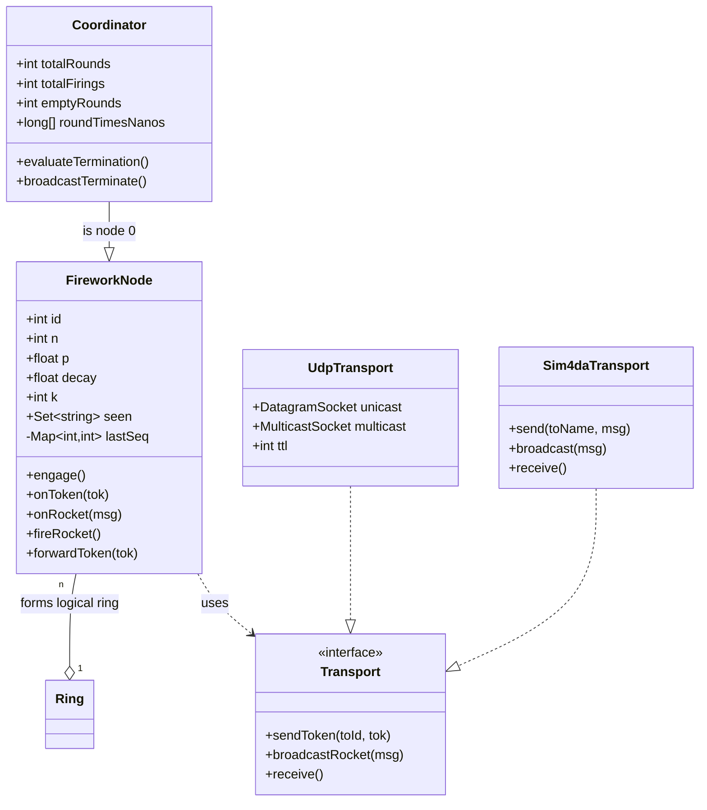
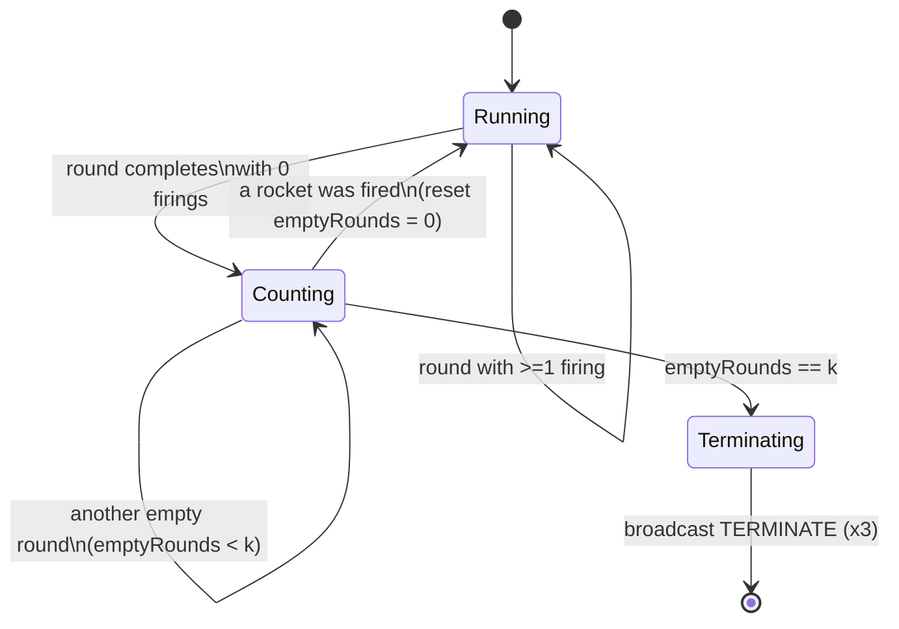

# UML diagrams

GitHub renders Mermaid in Markdown directly. The same diagrams are embedded in
`report/report.md`; they live here as well so they can be referenced and
re-rendered independently.

## 1. Class / component diagram

The same conceptual structure is realised twice: once over real UDP sockets
(Aufgabe 1 + 2, in Python) and once inside the `sim4da` simulator (Aufgabe 3 +
4, in Java). The roles line up one-to-one.



## 2. Sequence diagram — one token round with a rocket

The token travels reliably around the ring (UDP unicast / sim4da `send`). A
node that decides to fire emits one broadcast (UDP multicast / sim4da
`broadcast`) seen by all nodes. The coordinator closes the round and decides
termination.

```mermaid
sequenceDiagram
    participant C as Node0 (Coordinator)
    participant A as Node1
    participant B as Node2
    Note over C: round r starts (t0 = now)
    C->>A: TOKEN(round=r)
    A->>A: fire? p=0.5 -> yes
    A-)C: ROCKET(src=1,seq=3)
    A-)B: ROCKET(src=1,seq=3)
    A->>A: p <- p*decay
    A->>B: TOKEN(round=r)
    B->>B: fire? p=0.25 -> no
    B->>B: p <- p*decay
    B->>C: TOKEN(round=r)
    Note over C: round r done; firings>0 -> reset empty-counter
    C->>C: record round time = now - t0
```

## 3. State machine — termination rule

The coordinator drives termination: it counts consecutive rounds in which the
whole ring fired nothing, and stops after `k` of them.



## 4. Consistency mechanism (Aufgabe 4)

How the unreliable broadcast is reconciled by the reliable token. The token
carries a log of rocket ids; each node merges it into its `seen` set, so every
node converges within one extra lap even if multicast datagrams were lost.

```mermaid
sequenceDiagram
    participant C as Coordinator
    participant X as Node i
    participant Y as Node j
    Note over C,Y: multicast is lossy -> views may diverge
    C-)X: ROCKET(src=C,seq=s)
    C--xY: ROCKET lost!
    Note over Y: Y has NOT seen rocket (C,s)
    C->>X: TOKEN(log = {prev-round rocket ids})
    X->>X: seen += log ; append own fired ids
    X->>Y: TOKEN(log = {... , (C,s)})
    Y->>Y: seen += log  -> now contains (C,s)
    Note over Y: view repaired via reliable token (reconciledViaToken++)
```
